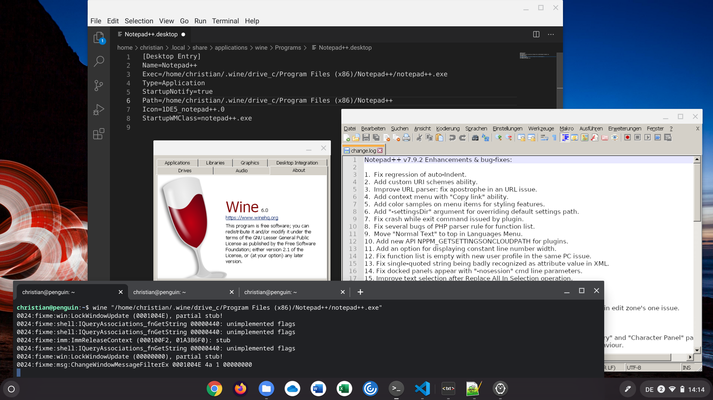

# WINE-on-ChromeOS

This shell-script can be used to install WINE in the Chrome OS Linux environment. It was inspired by the how-tos I found [here](https://beebom.com/how-use-windows-10-apps-chromebook-using-wine/) and [here](https://www.linuxmadesimple.info/2020/07/how-to-install-wine-501-on-chromebook.html). The commands would not work for me in the first place, though. As it turned out, the "--keyserver" parameter needed to be enhanced with protocol and port, as mentioned [here](https://unix.stackexchange.com/questions/361642/keyserver-receive-failed-on-every-keyserver-available).

Now the script automatically executes all necessary steps to setup WINE and launch it's configuration tool. Just install the Linux (Beta) on your Chromebook, preferably choosing more than the default partition size of 10.0 GB. Then update Linux...

```
sudo apt-get update
sudo apt-get dist-upgrade
```

...and install WINE by issuing the following command:

```
bash <(curl -sL https://raw.githubusercontent.com/cknermann/WINE-on-ChromeOS/main/wine-on-chromeos.sh)
```

Be sure to carefully monitor the free disk space of the Linux system and be ready to expand the partition, depending on which Windows applications you're going to install. Further consider that WINE will deploy not-working shortcuts in Chrome OS' launcher and you will have to manually repair them, as outlined [here](https://beebom.com/how-use-windows-10-apps-chromebook-using-wine/). You will find the shortcuts in /home/*\<username\>*/.local/share/applications/wine/Programs/:



I have successfully tested this using Google Chrome OS up to version 94.0 and the Linux environment running Debian 10 "Buster". It's just a tiny little script to speed up things a bit, which comes "as-it-is" without any warranties or support. Please feel free to adapt it to suit your needs.